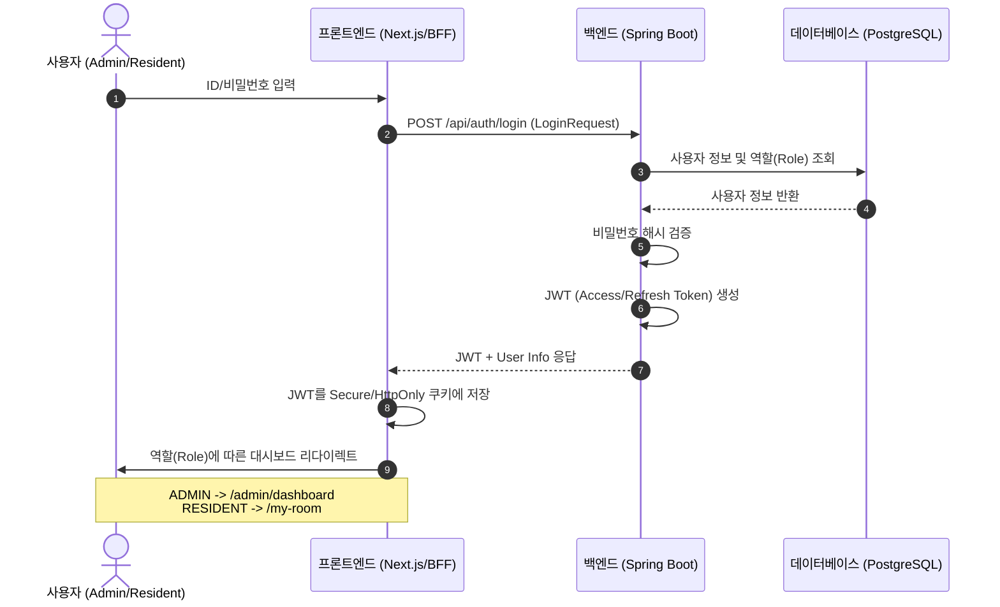
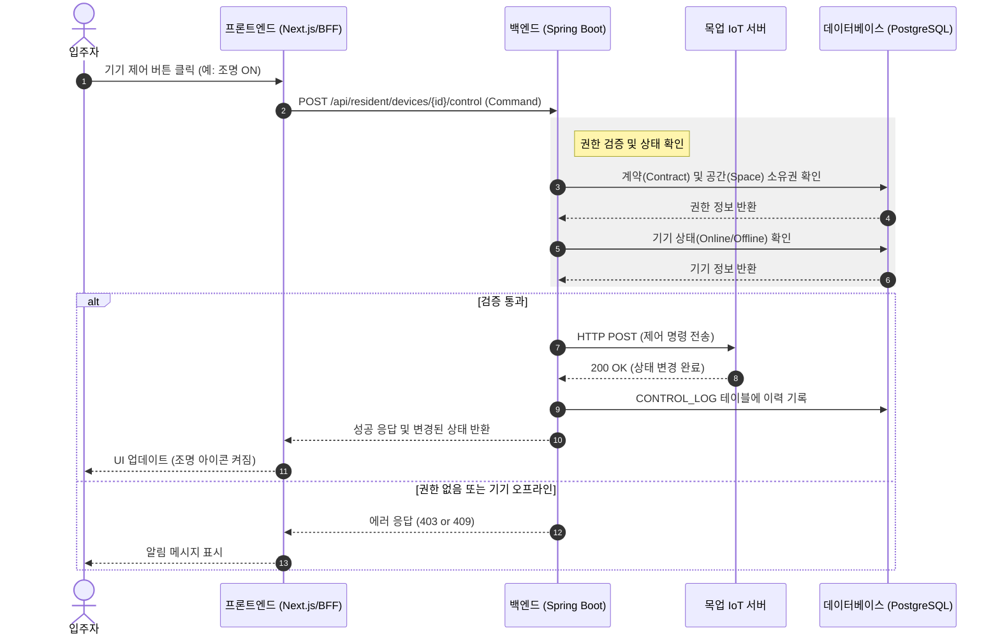
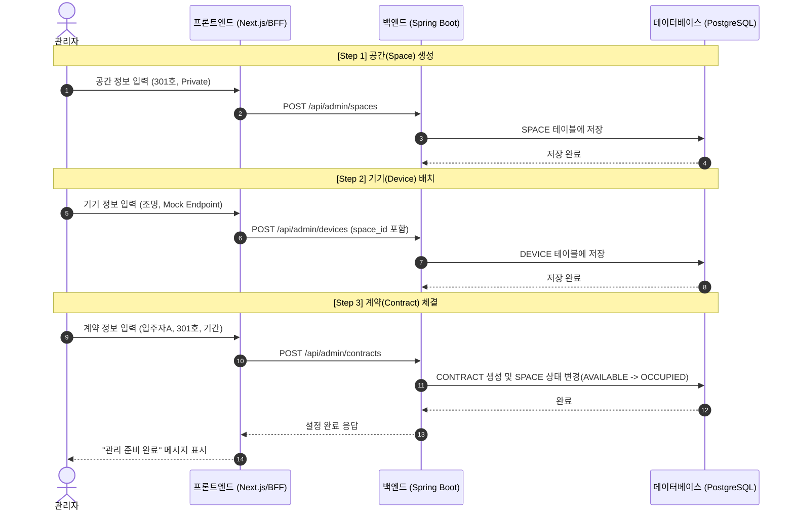

# Core Flow Blueprints (핵심 비즈니스 로직 설계)

이 문서는 **Must 기능**을 중심으로 한 시스템의 핵심 동작 흐름을 시각화한 블루프린트입니다. 각 시퀀스 다이어그램은 프론트엔드(BFF), 백엔드(Spring), 외부 시스템(Mock IoT), 그리고 데이터베이스 간의 상호작용을 보여줍니다.

---

## 1. 인증 및 인가 플로우 (Login & Auth)
사용자가 로그인하여 권한에 맞는 대시보드로 진입하는 과정입니다.

---

## 2. 입주자 기기 제어 플로우 (Device Control)
입주자가 본인의 방에 있는 IoT 기기를 제어하고, 그 이력이 기록되는 과정입니다.

---

## 3. 관리자 운영 설정 플로우 (Admin Setup Flow)
관리자가 새로운 공간을 만들고, 기기를 배치하고, 입주자와 계약을 연결하는 초기 설정 과정입니다.

---

## 4. 블루프린트 활용 가이드
- **개발 우선순위**: 위 흐름도(1->2->3) 순서대로 API 인터페이스를 확정(API Freeze)하고 개발을 진행하면 병목 현상을 최소화할 수 있습니다.
- **예외 처리**: 각 넘버링 단계(autonumber)에서 발생할 수 있는 에러 상황(DB 장애, 통신 장애 등)을 백엔드 비즈니스 로직 구현 시 참고하세요.
