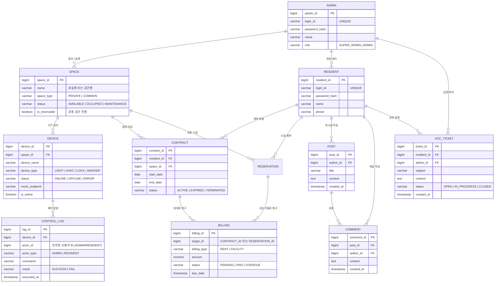

# CoLiving IoT 플랫폼 — ERD & 테이블 정의서 (v2.0)

> [!IMPORTANT]
> 기획안 및 기능 명세서의 **MoSCoW(Must/Should)** 기능을 모두 수용하도록 설계되었습니다.
> 관리자는 전체 자산(공간, 기기, 사용자)을 관리하며, 입주자는 본인의 **계약**을 기반으로 권한 내 기기 및 서비스를 이용합니다.

---

## 1. ERD (Entity Relationship Diagram)

---

## 2. 테이블 상세 정의

### 2.1 사용자 및 권한

#### [ADMIN] (관리자) - 시스템 운영 주체
| 컬럼 | 타입 | 제약 | 설명 |
|---|---|---|---|
| `admin_id` | BIGINT | PK | 관리자 고유 ID |
| `login_id` | VARCHAR(50) | UNIQUE | 로그인 ID |
| `password_hash` | VARCHAR(255) | | 암호화된 비밀번호 |
| `name` | VARCHAR(50) | | 관리자 성함 |
| `role` | VARCHAR(20) | | SUPER_ADMIN / ADMIN |

#### [RESIDENT] (입주자) - 서비스 실사용자
| 컬럼 | 타입 | 제약 | 설명 |
|---|---|---|---|
| `resident_id` | BIGINT | PK | 입주자 고유 ID |
| `login_id` | VARCHAR(50) | UNIQUE | 로그인 ID |
| `password_hash` | VARCHAR(255) | | 암호화된 비밀번호 |
| `name` | VARCHAR(50) | | 입주자 성함 |
| `phone` | VARCHAR(20) | | 비상 연락처 |

### 2.2 공간 및 자산 관리

#### [SPACE] (공간)
| 컬럼 | 타입 | 제약 | 설명 |
|---|---|---|---|
| `space_id` | BIGINT | PK | 공간 고유 ID |
| `name` | VARCHAR(100) | | 예: "301호", "공용 세탁실" |
| `space_type` | VARCHAR(20) | | PRIVATE(호실) / COMMON(공용) |
| `status` | VARCHAR(20) | | AVAILABLE / OCCUPIED / MAINTENANCE |
| `is_reservable` | BOOLEAN | | 예약 가능 여부 (공용 공간 전용) |

#### [DEVICE] (IoT 기기)
| 컬럼 | 타입 | 제약 | 설명 |
|---|---|---|---|
| `device_id` | BIGINT | PK | 기기 고유 ID |
| `space_id` | BIGINT | FK | 설치된 공간 ID |
| `device_name` | VARCHAR(100) | | 기기명 (예: 거실 조명) |
| `device_type` | VARCHAR(20) | | LIGHT / HVAC / LOCK / WASHER |
| `status` | VARCHAR(20) | | ONLINE / OFFLINE / ERROR |
| `mock_endpoint` | VARCHAR(255) | | 목업 서버 호출 URL |
| `is_active` | BOOLEAN | | 서비스 활성화 여부 |

### 2.3 업무 로직 (계약, 예약, 결제)

#### [CONTRACT] (임대 계약)
| 컬럼 | 타입 | 제약 | 설명 |
|---|---|---|---|
| `contract_id` | BIGINT | PK | 계약 고유 ID |
| `resident_id` | BIGINT | FK | 임차인 |
| `space_id` | BIGINT | FK | 대상 호실 (PRIVATE) |
| `start_date` | DATE | | 입주 시작일 |
| `end_date` | DATE | | 퇴거 예정일 |
| `status` | VARCHAR(20) | | ACTIVE / EXPIRED / TERMINATED |

#### [BILLING] (결제 및 정산)
| 컬럼 | 타입 | 제약 | 설명 |
|---|---|---|---|
| `billing_id` | BIGINT | PK | 결제 고유 ID |
| `target_id` | BIGINT | | CONTRACT_ID(월세) 또는 RESERVATION_ID(시설료) |
| `billing_type` | VARCHAR(20) | | RENT / FACILITY |
| `amount` | NUMERIC(12,0) | | 청구 금액 |
| `status` | VARCHAR(20) | | PENDING / PAID / OVERDUE |
| `due_date` | TIMESTAMP | | 납부 기한 |

### 2.4 커뮤니티 및 민원 (Should)

#### [POST / COMMENT] (게시판)
관리자와 입주자 간 소통 및 입주자 커뮤니티를 위한 테이블입니다.

#### [VOC_TICKET] (민원건)
| 컬럼 | 타입 | 제약 | 설명 |
|---|---|---|---|
| `ticket_id` | BIGINT | PK | 민원 ID |
| `resident_id` | BIGINT | FK | 접수자 |
| `admin_id` | BIGINT | FK | 담당 관리자 (Optional) |
| `subject` | VARCHAR(200) | | 민원 제목 |
| `content` | TEXT | | 민원 내용 |
| `status` | VARCHAR(20) | | OPEN / IN_PROGRESS / CLOSED |
| `created_at` | TIMESTAMP | | 접수 일시 |

---

## 3. 핵심 관계 요약 (권한 검증 흐름)

- **입주자의 기기 제어 권한**:
  `RESIDENT` ➔ `CONTRACT (status='ACTIVE')` ➔ `SPACE` ➔ `DEVICE`
  *서버 측 검증: 로그인한 입주자의 ACTIVE 계약에 포함된 SPACE의 기기인지 확인 필수.*

- **관리자의 접근 범위**:
  관리자는 모든 `SPACE` 및 연결된 `DEVICE`에 대해 무조건적인 접근 및 제어 권한을 가짐 (`actor_type='ADMIN'`).

- **정산 흐름**:
  계약 기반 월세 청구 및 시설 예약 기반 이용료 청구가 `BILLING` 테이블로 통합 관리됨.
