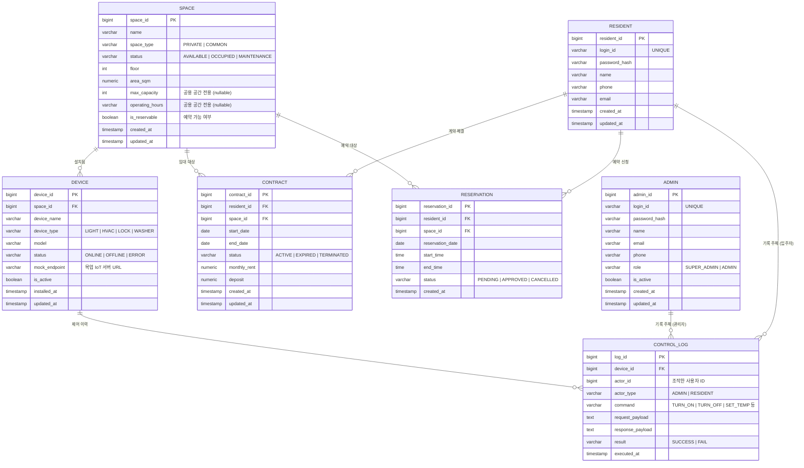
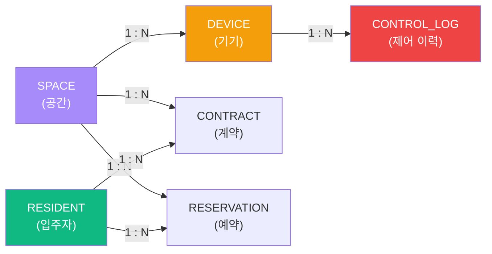

# CoLiving IoT 플랫폼 — ERD & 테이블 정의서

> [!NOTE]
> 기획안 섹션 7(도메인 모델)을 기반으로 작성한 **초안**입니다. 멘토 검토 후 확정하세요.
> 단일 시설(Single-Tenant) 구조이며, 운영사·사이트 개념은 제거되었습니다.

---

## 1. ERD (Entity Relationship Diagram)

---

## 2. 테이블 정의서

### 2.1 ADMIN (관리자)

| 컬럼 | 타입 | PK/FK | NULL | 설명 |
|---|---|---|---|---|
| `admin_id` | BIGINT | PK | NO | 관리자 고유 ID (AUTO_INCREMENT) |
| `login_id` | VARCHAR(50) | UNIQUE | NO | 로그인 ID |
| `password_hash` | VARCHAR(255) | | NO | BCrypt 등으로 암호화된 비밀번호 |
| `name` | VARCHAR(50) | | NO | 관리자 이름 |
| `email` | VARCHAR(255) | | YES | 이메일 |
| `phone` | VARCHAR(20) | | YES | 연락처 |
| `role` | VARCHAR(20) | | NO | **SUPER_ADMIN** (최고 관리자) / **ADMIN** (일반 관리자) |
| `is_active` | BOOLEAN | | NO | 계정 활성화 여부 (기본값: true) |
| `created_at` | TIMESTAMP | | NO | 등록일시 |
| `updated_at` | TIMESTAMP | | YES | 수정일시 |

### 2.2 RESIDENT (입주자)

| 컬럼 | 타입 | PK/FK | NULL | 설명 |
|---|---|---|---|---|
| `resident_id` | BIGINT | PK | NO | 입주자 고유 ID (AUTO_INCREMENT) |
| `login_id` | VARCHAR(50) | UNIQUE | NO | 로그인 ID |
| `password_hash` | VARCHAR(255) | | NO | 암호화된 비밀번호 |
| `name` | VARCHAR(50) | | NO | 이름 |
| `phone` | VARCHAR(20) | | YES | 연락처 |
| `email` | VARCHAR(255) | | YES | 이메일 |
| `created_at` | TIMESTAMP | | NO | 등록일시 |
| `updated_at` | TIMESTAMP | | YES | 수정일시 |

### 2.3 SPACE (공간 — 호실 + 공용)

| 컬럼 | 타입 | PK/FK | NULL | 설명 |
|---|---|---|---|---|
| `space_id` | BIGINT | PK | NO | 공간 고유 ID (AUTO_INCREMENT) |
| `name` | VARCHAR(100) | | NO | 공간명 (예: "301호", "1층 세탁실") |
| `space_type` | VARCHAR(20) | | NO | **PRIVATE** (호실) / **COMMON** (공용) |
| `status` | VARCHAR(20) | | NO | AVAILABLE / OCCUPIED / MAINTENANCE |
| `floor` | INT | | YES | 층수 |
| `area_sqm` | NUMERIC(6,2) | | YES | 면적 (㎡) |
| `max_capacity` | INT | | YES | 최대 수용 인원 (**공용만**) |
| `operating_hours` | VARCHAR(50) | | YES | 운영 시간 (**공용만**, 예: "06:00-23:00") |
| `is_reservable` | BOOLEAN | | NO | 예약 가능 여부 (공용: true, 호실: false) |
| `created_at` | TIMESTAMP | | NO | 등록일시 |
| `updated_at` | TIMESTAMP | | YES | 수정일시 |

> [!IMPORTANT]
> `space_type`으로 PRIVATE/COMMON을 구분합니다. 공용 전용 컬럼(`max_capacity`, `operating_hours`)은 PRIVATE일 때 NULL이 됩니다. MVP 이후 속성이 많이 분화되면 **서브타입 테이블 분리**를 검토하세요.

### 2.4 CONTRACT (계약)

| 컬럼 | 타입 | PK/FK | NULL | 설명 |
|---|---|---|---|---|
| `contract_id` | BIGINT | PK | NO | 계약 고유 ID (AUTO_INCREMENT) |
| `resident_id` | BIGINT | FK → RESIDENT | NO | 입주자 |
| `space_id` | BIGINT | FK → SPACE | NO | 계약 대상 호실 |
| `start_date` | DATE | | NO | 계약 시작일 |
| `end_date` | DATE | | NO | 계약 종료일 |
| `status` | VARCHAR(20) | | NO | ACTIVE / EXPIRED / TERMINATED |
| `monthly_rent` | NUMERIC(10,0) | | NO | 월 임대료 (원) |
| `deposit` | NUMERIC(12,0) | | YES | 보증금 (원) |
| `created_at` | TIMESTAMP | | NO | 등록일시 |
| `updated_at` | TIMESTAMP | | YES | 수정일시 |

### 2.5 DEVICE (기기)

| 컬럼 | 타입 | PK/FK | NULL | 설명 |
|---|---|---|---|---|
| `device_id` | BIGINT | PK | NO | 기기 고유 ID (AUTO_INCREMENT) |
| `space_id` | BIGINT | FK → SPACE | NO | 설치된 공간 |
| `device_name` | VARCHAR(100) | | NO | 기기명 (예: "301호 천장 조명") |
| `device_type` | VARCHAR(20) | | NO | LIGHT / HVAC / LOCK / WASHER 등 |
| `model` | VARCHAR(100) | | YES | 모델명 |
| `status` | VARCHAR(20) | | NO | ONLINE / OFFLINE / ERROR |
| `mock_endpoint` | VARCHAR(255) | | YES | 목업 IoT 서버 호출 URL |
| `is_active` | BOOLEAN | | NO | 활성화 여부 |
| `installed_at` | TIMESTAMP | | NO | 설치일시 |
| `updated_at` | TIMESTAMP | | YES | 수정일시 |

### 2.6 RESERVATION (예약)

| 컬럼 | 타입 | PK/FK | NULL | 설명 |
|---|---|---|---|---|
| `reservation_id` | BIGINT | PK | NO | 예약 고유 ID (AUTO_INCREMENT) |
| `resident_id` | BIGINT | FK → RESIDENT | NO | 예약 신청 입주자 |
| `space_id` | BIGINT | FK → SPACE | NO | 예약 대상 공용 공간 |
| `reservation_date` | DATE | | NO | 예약 날짜 |
| `start_time` | TIME | | NO | 시작 시각 |
| `end_time` | TIME | | NO | 종료 시각 |
| `status` | VARCHAR(20) | | NO | PENDING / APPROVED / CANCELLED |
| `created_at` | TIMESTAMP | | NO | 등록일시 |

### 2.7 CONTROL_LOG (제어 이력)

| 컬럼 | 타입 | PK/FK | NULL | 설명 |
|---|---|---|---|---|
| `log_id` | BIGINT | PK | NO | 로그 고유 ID (AUTO_INCREMENT) |
| `device_id` | BIGINT | FK → DEVICE | NO | 대상 기기 |
| `actor_id` | BIGINT | | NO | 제어한 사용자 ID (ADMIN 또는 RESIDENT의 PK) |
| `actor_type` | VARCHAR(20) | | NO | **ADMIN** / **RESIDENT** |
| `command` | VARCHAR(50) | | NO | 제어 명령 (TURN_ON, TURN_OFF, SET_TEMP 등) |
| `request_payload` | TEXT | | YES | 요청 본문 (JSON) |
| `response_payload` | TEXT | | YES | 응답 본문 (JSON) |
| `result` | VARCHAR(10) | | NO | SUCCESS / FAIL |
| `executed_at` | TIMESTAMP | | NO | 실행 시각 |

---

## 3. 주요 관계 요약

> [!TIP]
> **핵심 흐름:** Space → Device → ControlLog 가 IoT 제어의 메인 경로이고, Resident → Contract → Space 가 입주 관리의 메인 경로입니다.
